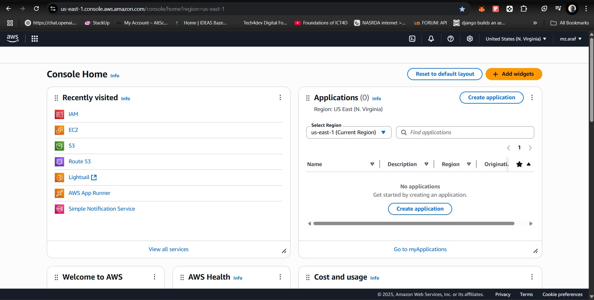
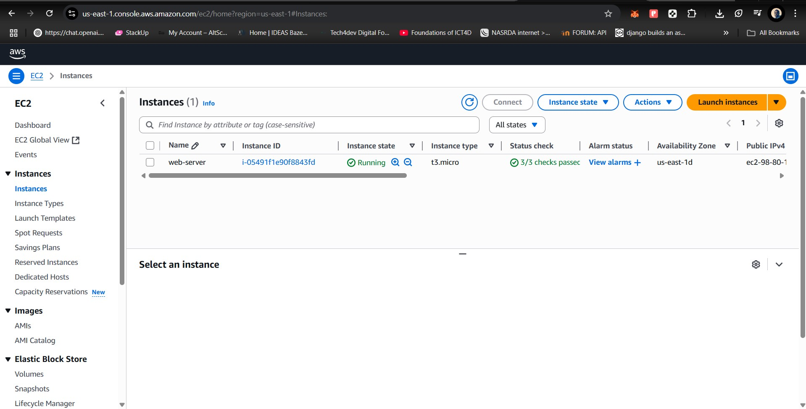
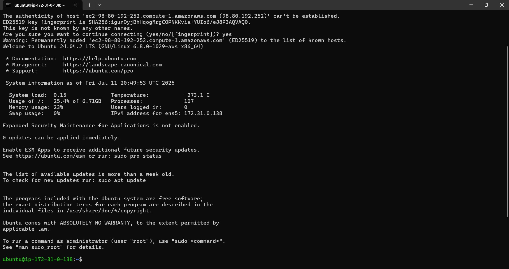
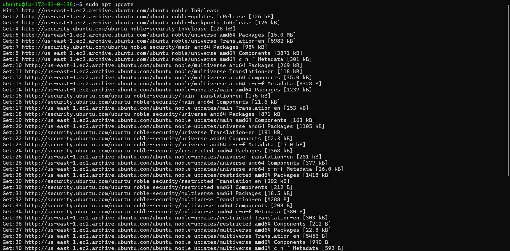
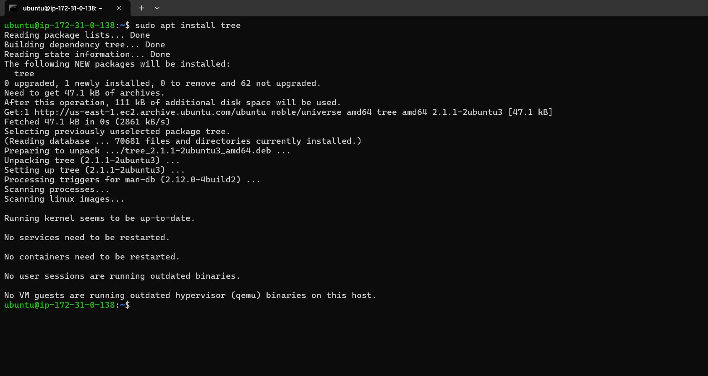
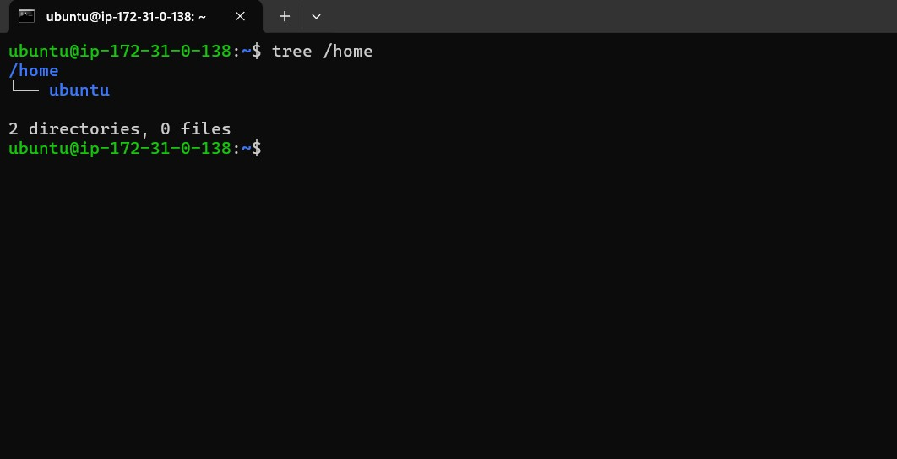
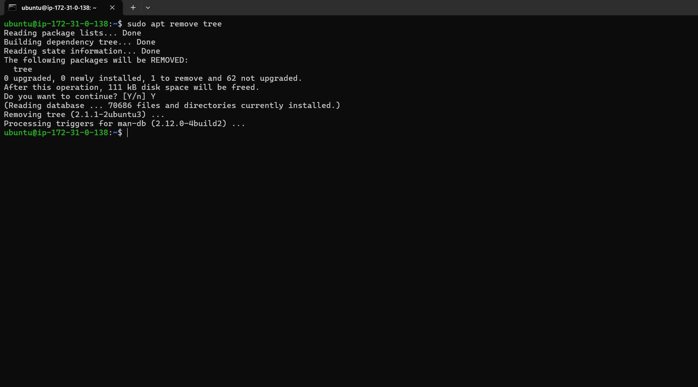

# linux-fundamentals
## Installation and Initial Setup
I created and AWS acount and signed in to the account

Then I opened the instances console and created a new EC2 instance

## Connecting to the Server
Downloaded key-pair to my downloads folder on my system, opened the system terminal and then connect to the server using SSH with the public address of the instance

## Installing, Updating and Removing Software
I run the following command `sudo apt update` first to update the server

Then I run `sudo apt install tree` to install tree

To confirm tree is intalled I run `tree /home`

And to remove tree I run `sudo apt remove tree`
